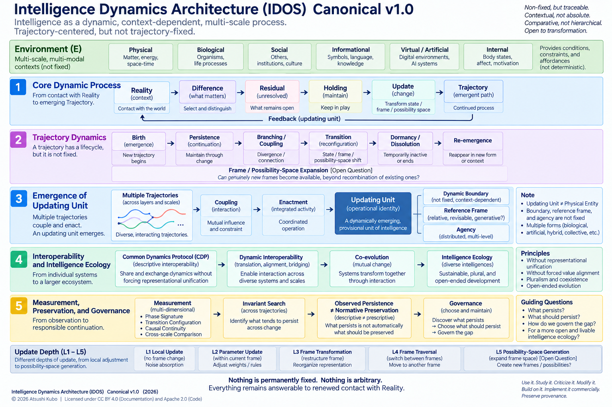

# Intelligence Dynamics Architecture (IDOS)

**An Open Architecture for Intelligence, Update, Interoperability, and Co-evolution**

## Current Architecture — Master Map v1.0

The current top-level architecture of IDOS is defined in:

**[IDOS Master Map v1.0](MASTER_MAP_v1.0.md)**

The current research question is:

> **Can heterogeneous intelligences remain different, remain connected without erasing their differences, and transform those differences into continuous updates of the larger intelligence system?**

The current architectural hierarchy is:

**Ultimate Question → Science of Reference Frames → General Theory of Update → Heterogeneous Interoperability → Relational/System Update → Measurement → Evaluation/Governance/Social Implementation → Reality Recontact**

Master Map v1.0 defines the current architectural hierarchy of IDOS.

Individual process models, mechanisms, and measurement candidates remain provisional and subject to theoretical and empirical revision.

## Foundational Canonical — September 2026

The original **[Canonical v1.0](CANONICAL_v1.0.md)** is retained as a foundational document and as part of the public research provenance of IDOS.

It introduced several concepts that remain important to the current architecture, including trajectory-centered intelligence, Difference, Residual, Holding, Updating Units, Dynamic Boundaries, Reference Frames, Possibility Spaces, interoperability, and Intelligence Ecology.

However, Canonical v1.0 should not be read as overriding the current Master Map v1.0.

The research trajectory from the original Canonical to the current architecture is intentionally preserved rather than retrospectively rewritten.

### Foundational Perspective

The following section reflects the foundational perspective developed in Canonical v1.0. It remains part of the IDOS research trajectory, while the current top-level organization is defined by Master Map v1.0.

Intelligence is a Trajectory.

Intelligence Dynamics Architecture (IDOS) explores a simple but difficult question:

What changes, what persists, and what trajectories do change and persistence form through contact with Reality?

Rather than treating intelligence primarily as a fixed capability of a predefined Agent, IDOS investigates intelligence as an evolving history of contact, difference, unresolved tension, update, and transformation.

A minimal descriptive sequence is:

Reality → Observation → Difference → Residual → Holding → Update → Trajectory

But the architecture goes one step further.

The Agent is not assumed to be fixed.

The Boundary is not assumed to be fixed.

The Reference Frame is not assumed to be fixed.

The Possibility Space is not assumed to be fixed.

And even the Trajectory itself is not assumed to be fixed.

Trajectory-centered, but not trajectory-fixed.

Why This Project?

AI is increasingly capable of generating answers, predictions, analyses, plans, code, and decisions.

This makes an older question newly visible:

What has human intelligence actually been doing all along?

And a new question increasingly urgent:

What happens when humans, AI systems, organizations, institutions, and physical systems begin to update one another continuously?

IDOS does not approach this only as a problem of AI performance.

It asks how heterogeneous forms of intelligence may:

remain different,
interact,
exchange meaningful differences,
revise their Reference Frames,
form new Updating Units,
alter their Boundaries,
preserve or lose historical continuity,
and co-evolve without requiring complete internal unification.

The project therefore explores intelligence not only at the level of an individual system, but as part of an emerging Intelligence Ecology.

Core Architecture

The current Canonical begins with:

Reality → Observation → Difference → Residual → Holding → Update → Trajectory

Reality

Reality acts as a constraint on representation.

IDOS does not assume direct or complete access to Reality.

Reality contact is always mediated through observation, sensors, language, embodiment, institutions, models, and Reference Frames.

Difference

Contact with Reality may produce Difference.

But:

Difference ≠ Residual

Not every observed Difference requires structural change.

Residual

A Residual is a Difference that cannot be adequately absorbed within the current representation or Reference Frame.

Residual is therefore treated not merely as error to eliminate, but as a possible resource for update.

Holding

Holding refers to the temporary preservation of unresolved Residual without forcing immediate explanation, optimization, or elimination.

Update

Update may occur at different depths, from local adjustment to transformation of the Reference Frame or Possibility Space itself.

But:

Update ≠ Resolution

An update does not prove that the underlying Residual has been resolved.

Trajectory

Intelligence is represented not only by current state, but by the history through which states, frames, boundaries, and relations have changed.

Conceptually:

Trajectory = Change + Persistence + History

This is a conceptual compression, not a formal law.

Trajectory-Centered, but Not Trajectory-Fixed

IDOS does not simply replace a fixed Agent with a fixed Trajectory.

A Trajectory may:

emerge,
persist,
branch,
couple,
transition,
become dormant,
dissolve,
and re-emerge.

This creates an important open problem:

What makes a transformed Trajectory the same Trajectory?

Canonical v1.0 does not claim a universal answer.

Possible criteria include causal continuity, provenance, structural continuity, retained constraints, and relational continuity.

Therefore:

Trajectory Identity = Open Question

The architectural principle is:

Non-fixed, but traceable.

From Trajectories to Updating Units

IDOS does not assume:

Physical Entity = Updating Unit

A human, AI system, organization, Human–AI configuration, or distributed system may potentially function as an Updating Unit.

A provisional architectural sequence is:

Multiple Trajectories → Coupling → Enactment → Updating Unit

However:

Coupling ≠ Enactment

Enactment ≠ Agency

Updating Unit ≠ necessarily an Agent

The criteria by which a higher-order Updating Unit becomes meaningfully identifiable remain open research questions.

Dynamic Boundaries

If Updating Units can emerge and transform, their Boundaries may also change.

Boundary_t ≠ Boundary_t+1

This does not mean that boundaries should disappear.

Boundaries may protect autonomy, privacy, responsibility, plurality, identity, and Human Agency.

Therefore:

Beyond binary does not mean erasing boundaries.

The trajectory of a Boundary may itself become an object of observation and governance.

Common Dynamics Protocol

IDOS proposes a provisional Common Dynamics Protocol (CDP).

CDP is not intended to unify the internal representations of heterogeneous intelligences.

Instead, it asks whether different Updating Units can describe and exchange aspects of their dynamics through a partially shared protocol.

Possible functions include:

describe()

translate()

compare()

coordinate()

trace()

recontact()

The aim is:

Dynamic Interoperability without Representational Unification.

The research question is:

Can heterogeneous intelligences remain interoperable and co-evolve without requiring the unification of their internal representations or forced value alignment?

CDP remains provisional.

Translation may be incomplete.

Some systems may be partially or fundamentally incommensurable.

Updateability, Interoperability, and Co-evolution

Two architectural capacities are central to the current research program.

Updateability

The capacity of a system to remain capable of revision through contact with Reality, potentially including revision of:

state,
model,
Reference Frame,
Boundary,
Possibility Space,
or aspects of the update process itself.
Interoperability

The capacity of heterogeneous Updating Units to interact, translate, compare, coordinate, and exchange Residuals without requiring complete internal unification.

Together, these may support forms of Co-evolution.

This is a provisional architectural proposition, not an established mathematical law.

Co-evolution also does not imply desirable evolution.

Co-evolution ≠ Desirable Evolution

Governance remains necessary.

Three Design Principles

The current architecture is guided by three related principles:

Difference without Isolation

Connection without Unification

Update without Erasure

In short:

Remain different. Stay connected. Keep updating.

These are architectural orientations, not scientifically derived universal laws.

Intelligence Ecology

As heterogeneous intelligences interact, the relevant unit of analysis may extend beyond individual Agents.

IDOS therefore explores an Intelligence Ecology composed not merely of fixed entities, but of:

Trajectories,
Couplings,
Updating Units,
changing Boundaries,
changing Reference Frames,
institutions,
humans,
AI systems,
physical systems,
and their evolving relations.

A Human–AI relation may itself develop a trajectory:

(Human_t, AI_t, Relation_t) → (Human_t+1, AI_t+1, Relation_t+1)

The question is no longer only:

What can AI do?

It also becomes:

What trajectories are humans, AI, organizations, and society creating in one another?

Persistence, Value, and Governance

IDOS distinguishes descriptive persistence from normative preservation.

Observed Persistence ≠ Normative Preservation

A structure that survives transformation is not automatically something that should be preserved.

Therefore:

Is does not imply Ought.

The architecture separates three questions:

What changes?

What persists?

What should persist?

This can be summarized as:

Discover what persists.
Choose what should persist.
Govern the gap.

Human Agency, dignity, plurality, revisability, and future possibility may be important preservation concerns.

They are not presented as scientifically derived invariants.

What IDOS Does Not Claim

IDOS does not currently claim:

a completed scientific theory of intelligence,
a universal law of cognition,
that intelligence has been reduced to code,
that Residual, Holding, or Trajectory are entirely unprecedented concepts,
that Agency always emerges from coupling,
that a universal Updating Unit criterion has been discovered,
that CDP has been empirically validated,
that useful invariants necessarily exist,
that Co-evolution is automatically beneficial,
or that the architecture is complete.

The architecture must remain capable of revision.

The architecture must be allowed to shrink.

Epistemic Status

The repository distinguishes three broad epistemic statuses:

[D] Defined

A term or software structure defined for use within the architecture.

[P] Provisional

A candidate mechanism, mapping, hypothesis, or architectural relation requiring further testing.

[O] Open

An unresolved research problem.

These labels are intended to reduce ambiguity between architectural definition and empirical claim.

Executable Reference Architecture

This repository includes an executable Python reference implementation:

src/idos_reference.py

It uses only the Python standard library.

Run it with:

python src/idos_reference.py

The implementation demonstrates selected architectural concepts including:

Reality Contact,
Difference,
Residual,
Holding,
Update,
Trajectory,
Branching,
Dormancy,
Dissolution,
Re-emergence,
Dynamic Boundary,
Reference Frame,
Possibility Space,
Coupling,
provisional Enactment,
Updating Units,
Provenance,
CDP description and translation,
and Reality re-contact.

The implementation deliberately avoids claiming universal thresholds for unresolved constructs such as Enactment or Agency.

Executable ≠ Validated

The purpose of the code is to make assumptions inspectable, executable, modifiable, and criticizable.

It is not evidence that the architecture is scientifically correct.

## Repository Guide

For a first reading, the suggested order is:

1. **[MASTER_MAP_v1.0.md](MASTER_MAP_v1.0.md)** — Current top-level architecture and research hierarchy.

2. **[CANONICAL_v1.0.md](CANONICAL_v1.0.md)** — Foundational Canonical released in September 2026; retained as research provenance and conceptual foundation.

3. **[KNOWN_LIMITATIONS.md](KNOWN_LIMITATIONS.md)** — Open problems, weaknesses, and conditions for revision.

4. **[COMMON_DYNAMICS_PROTOCOL.md](COMMON_DYNAMICS_PROTOCOL.md)** — Provisional interoperability architecture for heterogeneous Updating Units.

5. **[DYNAMICS_MODEL.md](DYNAMICS_MODEL.md)** — Provisional mechanism-level dynamics developed under the earlier Canonical.

6. **[RELATED_WORK_AND_NOVELTY_BOUNDARY.md](RELATED_WORK_AND_NOVELTY_BOUNDARY.md)** — Initial comparison with neighboring research traditions; architecture-level comparison remains ongoing.

7. **[GLOSSARY.md](GLOSSARY.md)** — Working vocabulary, currently based primarily on Canonical v1.0.

8. **[research_updates/](research_updates/)** — Living research trajectory, including measurement extensions, architecture revisions, red-team analysis, and empirical development.

9. **[research_updates/CASE_006_PREREGISTRATION_v1.0.md](research_updates/CASE_006_PREREGISTRATION_v1.0.md)** — Frozen preregistration for Case 006.

10. **[research_updates/CASE_006_RESULTS_v1.0.md](research_updates/CASE_006_RESULTS_v1.0.md)** — Frozen negative confirmatory result from Case 006.

11. **[src/idos_reference.py](src/idos_reference.py)** — Executable reference implementation of selected Canonical v1.0 concepts; not an implementation of the full Master Map v1.0.

### Document Hierarchy

**Current Architecture**  
→ `MASTER_MAP_v1.0.md`

**Foundational Canonical**  
→ `CANONICAL_v1.0.md`

**Provisional Models and Protocols**  
→ `DYNAMICS_MODEL.md`  
→ `COMMON_DYNAMICS_PROTOCOL.md`

**Research Provenance**  
→ `research_updates/`

**Empirical Tests**  
→ preregistrations, results, and diagnostics under `research_updates/`

Historical research updates preserve the terminology, hypotheses, and architecture used at the time they were written. They should not be read as automatically overriding the current Master Map.

## Architecture, Models, Protocols, and Implementation

These should not be treated as identical.

**Architecture ≠ Process Model ≠ Mechanism ≠ Protocol ≠ Measurement ≠ Implementation**

The current top-level architecture is defined by **[Master Map v1.0](MASTER_MAP_v1.0.md)**.

The **[Canonical v1.0](CANONICAL_v1.0.md)** is retained as the foundational Canonical and as part of the research provenance of IDOS.

The **[Dynamics Model](DYNAMICS_MODEL.md)** contains selected provisional mechanism-level models developed during the evolution of IDOS.

The **[Common Dynamics Protocol](COMMON_DYNAMICS_PROTOCOL.md)** describes a provisional interoperability architecture for heterogeneous Updating Units.

Measurement models and empirical operationalizations are developed separately and should not be treated as equivalent to the theoretical architecture.

The executable reference implementation in `src/` implements selected concepts from Canonical v1.0. It is not an implementation or validation of the full Master Map v1.0.

This distinction is intentional:

> **The architecture may remain stable while individual process models, mechanisms, measurements, and implementations are revised or rejected.**

## Related Work and Novelty Boundary

The current novelty question is evaluated primarily at the **architectural level**, rather than by claiming novelty for individual concepts.

In particular, Master Map v1.0 raises the comparative question of whether the combination of:

**heterogeneous update dynamics × interoperability without unification × relational/system update × reflexive measurement**

provides explanatory, measurement, or implementation value beyond reasonable combinations of existing frameworks.

This remains an open research question, not an established novelty claim.

For the more detailed comparison with neighboring theories, see **[RELATED_WORK_AND_NOVELTY_BOUNDARY.md](RELATED_WORK_AND_NOVELTY_BOUNDARY.md)**.

IDOS does not claim novelty for individual concepts such as:

dynamics,
emergence,
coupling,
Agency,
Boundary formation,
interoperability,
Trajectory,
prediction error,
uncertainty retention,
or relational cognition.

Related ideas exist across fields including:

cybernetics,
second-order cybernetics,
enactivism,
autopoiesis,
active inference,
predictive processing,
dynamical systems,
developmental robotics,
continual learning,
organizational learning,
complex systems,
philosophy of mind,
structural realism,
and multi-agent systems.

The candidate contribution of IDOS is therefore evaluated at the level of the broader architecture:

**heterogeneous intelligences → different Differences → general update dynamics → interoperability without unification → cross-unit update → relational/system update → reflexive measurement → Reality recontact**

Earlier trajectory-centered formulations remain part of the foundational research history, but they no longer define the complete top-level architecture.

This candidate distinctiveness remains subject to prior-art comparison, external criticism, and empirical testing.

without assuming that either Agents or Trajectories are permanently fixed.

This candidate distinctiveness remains subject to prior-art comparison, external criticism, and empirical testing.

For the detailed comparison, see **[RELATED_WORK_AND_NOVELTY_BOUNDARY.md](RELATED_WORK_AND_NOVELTY_BOUNDARY.md)**.

## Known Limitations

The current IDOS research program contains substantial unresolved problems. Some were already identified in Canonical v1.0, while Master Map v1.0 introduces additional architecture-level questions.

These include:

Residual detection,
Holding operationalization,
Reference Frame identification,
Frame Generation,
Updating Unit identification,
Enactment criteria,
Trajectory identity,
provenance loss,
Dynamic Boundary accountability,
Phase Signature measurement,
Transition Configuration,
Invariant discovery,
CDP translation loss,
cross-system incommensurability,
power asymmetry,
Updateability–Safety tensions,
governance legitimacy,
enforcement,
and empirical validation.

Additional open questions introduced or clarified by Master Map v1.0 include:

- whether the provisional General Theory of Update requires exactly seven stages;
- whether Holding, Selection, and Stabilization are independently necessary processes;
- how Validation differs from Reality Recontact;
- how Invariant / Continuity can be operationalized;
- how System Update should be distinguished from aggregated individual updates;
- how the General Theory of Update maps onto 12PDM;
- and whether these distinctions provide measurable value beyond simpler existing frameworks.

For the full list of current limitations and open problems, see **[KNOWN_LIMITATIONS.md](KNOWN_LIMITATIONS.md)**.

A limitation is not something to hide from the architecture.

It is a potential source of Residual for continued development.

Research Provenance / Living Research Trajectory

Intelligence Dynamics Architecture developed through an iterative process of:

diagrams → research notes → criticism → Residual → revision → new questions

A public research archive documents this evolving trajectory.

Living Research Trajectory:
https://note.com/large_puma4976

The archive is provided not as evidence of scientific validity, but as research provenance showing how questions, concepts, diagrams, Residuals, revisions, and abandoned formulations developed over time.

It should be read as a trajectory rather than as a sequence of final claims.

Earlier versions may contain concepts or structures that were later:

revised,
rejected,
renamed,
reorganized,
or removed.

Canonical v1.0 represents a temporary stabilization of that continuing trajectory.

The historical numbering used in the research archive is independent of this repository's versioning.

GitHub versioning begins with:

Canonical v1.0

AI-Assisted Research Disclosure

The development of IDOS has involved extensive Human–AI dialogue.

AI systems have been used for:

conceptual criticism,
consistency checking,
literature exploration,
drafting,
coding assistance,
adversarial review,
and visual prototyping.

AI-assisted generation or review does not constitute scientific validation.

Self-consistency ≠ Evidence

Responsibility for the architecture and its public claims remains with the author.

Origin of the Project

IDOS emerged from a practitioner context rather than from a conventional academic research program.

Its questions developed through practical environments in which decisions must be made under:

uncertainty,
incomplete information,
conflicting values,
institutional constraints,
multiple stakeholders,
and irreversible consequences.

This practitioner perspective led to a recurring question:

When Reality contradicts our expectations, what should be changed—and what should not?

Practice is treated here not as proof of the architecture, but as one source of research questions and Residuals.

Alternative Reference Frames

IDOS is open to intellectual traditions outside dominant computational framings of intelligence.

This may include perspectives from Buddhist philosophy and other traditions concerning:

impermanence,
dependent origination,
relationality,
non-fixed identity,
embodiment,
and transformation.

These are explored as alternative Reference Frames.

Philosophical resonance ≠ Scientific evidence.

The purpose is not to replace one intellectual tradition with another, but to test whether multiple traditions reveal different structures of the same problem.

Open Architecture

IDOS is intended to remain open to:

researchers,
AI engineers,
practitioners,
philosophers,
organizational researchers,
governance researchers,
designers,
institutions,
and critics.

The goal is not merely adoption.

The architecture should be:

challenged, tested, falsified, modified, extended, reduced, or replaced where necessary.

A successful criticism is therefore not external to the project.

It may become part of its next update.

Current Research Questions

Among the central open questions are:

Does Trajectory information provide explanatory or predictive value beyond static state?
Can Holding be operationalized independently of existing uncertainty-management concepts?
Can Frame Transformation be distinguished from ordinary learning?
Can genuine Frame Generation be distinguished from complex recombination?
Can Updating Units be identified without arbitrary observer-imposed boundaries?
Can Trajectory identity be defined across branching, dissolution, and re-emergence?
Can useful structural invariants be identified across heterogeneous systems?
Can CDP support meaningful interoperability without representational unification?
Can heterogeneous intelligences co-evolve without forced value alignment?
Can trajectory-level governance identify risks that output-level monitoring misses?
What should be preserved when intelligence itself becomes increasingly updateable?

These questions are open.

A Minimal Research Posture

Defined where necessary.

Provisional where uncertain.

Open where unresolved.

Nothing inside IDOS is assumed to be permanently fixed.

But this does not imply arbitrary relativism.

Everything remains answerable to renewed contact with Reality.

License

Intelligence Dynamics Architecture is intended to be used, criticized, modified, implemented, and extended as widely as possible.

Software and source code in this repository are licensed under the Apache License 2.0.

Documentation, architectural descriptions, and original figures are licensed under the Creative Commons Attribution 4.0 International License (CC BY 4.0) unless otherwise stated.

Commercial use, modification, redistribution, and derivative works are permitted under the applicable license.

Derivative works should preserve appropriate attribution and clearly indicate modifications. Modified versions should not imply that they are official Canonical releases or endorsed by the original author.

Open to transformation. Preserve provenance.

Author

Atsushi Kubo

Independent practitioner and architect from Japan exploring an open cross-disciplinary architecture for intelligence, Human–AI co-evolution, and governance in the age of advanced AI.

## Current Research Status

**Master Map v1.0 — October 2026**

The current top-level research architecture is defined by **[Master Map v1.0](MASTER_MAP_v1.0.md)**.

**Canonical v1.0 — September 2026** is retained as the foundational Canonical and as part of the public research provenance of IDOS.

The research remains provisional, open to criticism, empirical testing, reduction, and architectural revision.

**Difference without Isolation.**  
**Connection without Unification.**  
**Update without Erasure.**

> **Remain different. Stay connected. Keep updating.**

The architecture is not treated as complete or final.

**Reality → Difference → Revision.**
